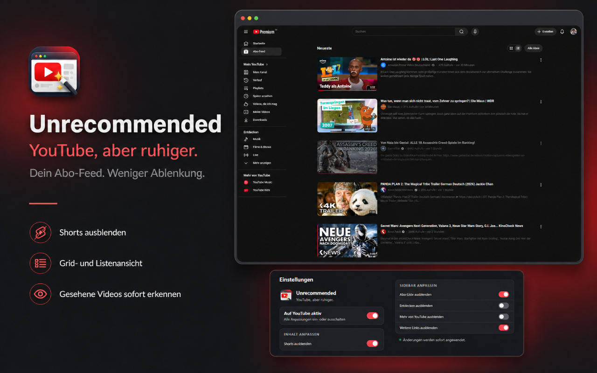

<p align="center">
  
</p>

<h1 align="center">Unrecommended</h1>

<p align="center"><strong>YouTube, aber ruhiger.</strong></p>

> [!IMPORTANT]
> Unrecommended wird derzeit noch für den Chrome Web Store geprüft und ist dort noch nicht verfügbar. Bis dahin kann die Erweiterung mit dem unten stehenden PowerShell-Befehl lokal eingerichtet werden.



## Was macht Unrecommended?

Unrecommended rückt deine abonnierten Kanäle wieder in den Mittelpunkt. Die Erweiterung räumt den YouTube-Abo-Feed auf, reduziert Ablenkungen und macht neue Videos leichter erfassbar.

- Shorts ausblenden
- zwischen Grid- und Listenansicht wechseln
- Videobeschreibungen direkt im Abo-Feed lesen
- weitgehend angesehene Videos sofort erkennen
- nicht benötigte Sidebar-Bereiche ausblenden
- alle Einstellungen direkt über das Erweiterungssymbol ändern
- automatische helle und dunkle Darstellung

## Installation unter Windows

Öffne PowerShell, kopiere die folgende Zeile vollständig hinein und bestätige mit Enter:

```powershell
irm https://raw.githubusercontent.com/CelduinX/Unrecommended/main/install.ps1 | iex
```

Der Befehl lädt die aktuelle Version herunter, entpackt sie in einen festen Ordner, kopiert den Ordnerpfad in die Zwischenablage und öffnet die Chrome-Erweiterungsseite.

Danach sind nur noch drei Schritte nötig:

1. **Entwicklermodus** oben rechts einschalten.
2. **Entpackte Erweiterung laden** auswählen.
3. Den bereits in die Zwischenablage kopierten Ordnerpfad einfügen und den Ordner auswählen.

Chrome erlaubt die vollständig automatische Installation lokaler Erweiterungen aus Sicherheitsgründen nicht. Sobald Unrecommended im Chrome Web Store freigegeben ist, entfällt dieser Zwischenschritt.

## Aktualisieren

Führe denselben PowerShell-Befehl erneut aus. Öffne danach `chrome://extensions` und klicke bei Unrecommended auf **Neu laden**.

## Datenschutz

Unrecommended verarbeitet die für seine Funktionen benötigten YouTube-Inhalte lokal im Browser. Es gibt keine Werbung, keine Telemetrie und keinen Verkauf von Nutzerdaten.

[Datenschutzerklärung öffnen](https://celduinx.github.io/Unrecommended/privacy.html)

## Probleme oder Wünsche

Über [GitHub Issues](https://github.com/CelduinX/Unrecommended/issues) kannst du Fehler melden oder Verbesserungen vorschlagen. Bitte teile dabei keine Passwörter, Cookies oder anderen vertraulichen Daten.

## Unabhängiges Projekt

Unrecommended ist ein unabhängiges Projekt und steht in keiner Verbindung zu YouTube oder Google. YouTube und Google sind Marken ihrer jeweiligen Inhaber.

## Lizenz

Copyright © 2026 Unrecommended contributors. Alle Rechte vorbehalten. Einzelheiten stehen in der Datei [LICENSE](LICENSE).
